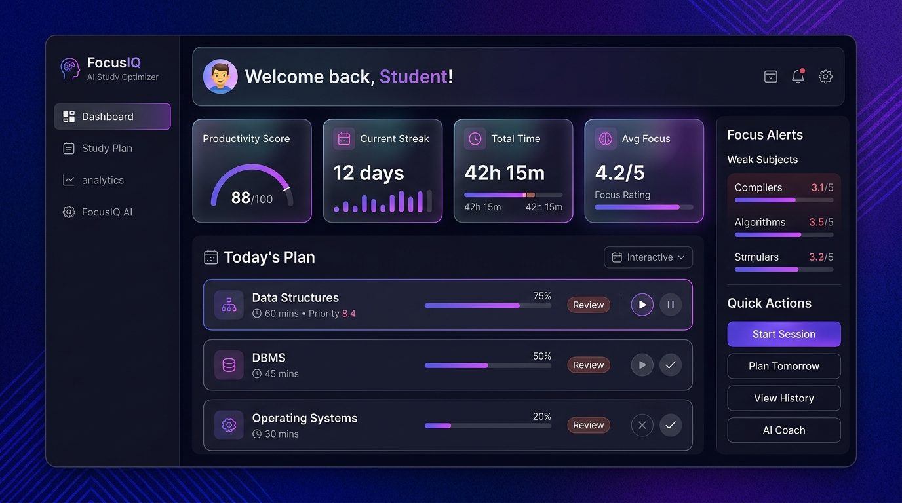
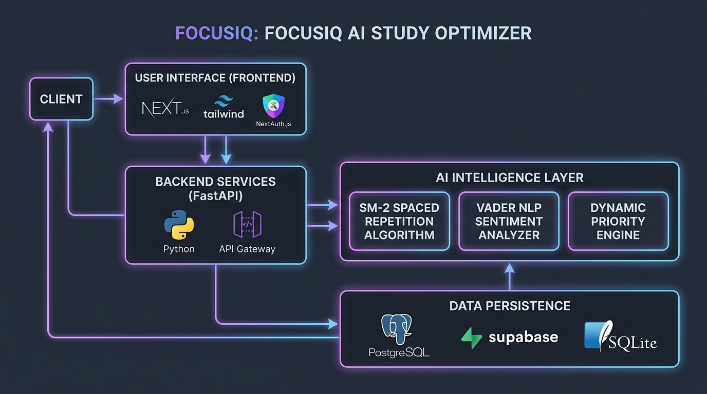
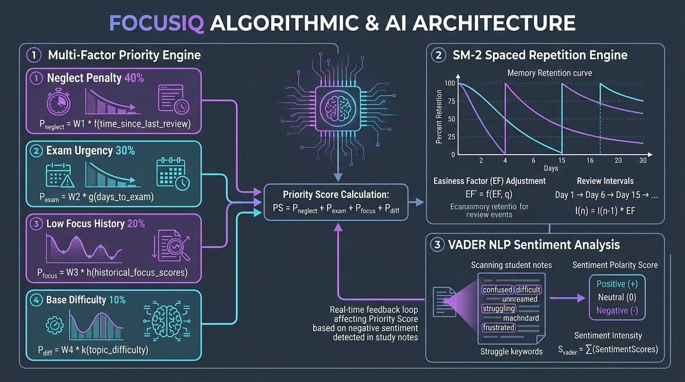

<div align="center">

# 🧠 FocusIQ

### AI-Powered Study Planner for Students

**Know exactly what to study today. Never waste a session again.**

[](https://focus-iq-two.vercel.app)
[](https://focusiq-api.onrender.com/docs)
[](https://github.com/kg3478/FocusIQ)

</div>

---

## 🎯 What is FocusIQ?

Most students open their books and wonder — *"What should I even study today?"*

**FocusIQ solves that.**

It is an AI study planner that builds a personalised daily schedule by analysing your exam dates, subject difficulty, focus history, and how long ago you last studied each topic. It tells you exactly what to study, for how long, and why — so you stop guessing and start improving.

> Think of it as having a personal academic coach that runs 24/7, costs nothing, and never gets tired.

---

## ✨ Key Features

| Feature | What it does |
|---|---|
| **🤖 AI Daily Planner** | Generates a ranked study schedule each day based on your unique data |
| **🔁 Spaced Repetition** | Uses the SM-2 algorithm to schedule reviews at the ideal memory interval |
| **⚡ Priority Engine** | Scores subjects by exam urgency, difficulty, neglect, and recent focus |
| **📊 Analytics Dashboard** | Visual charts for weekly hours, focus trends, streaks, and subject splits |
| **📝 Session Logger** | Log study sessions with minutes, focus rating, and free-text notes |
| **🧬 Sentiment Detection** | AI reads your notes to detect struggle — flags weak subjects automatically |
| **🔔 Smart Reminders** | Alerts you before exams and when a subject hasn't been studied in days |
| **🔐 Secure Auth** | Google Sign-In and email login via NextAuth — zero friction |

---

## 📸 Product Screenshots

> *Landing Page → Login → Dashboard → Analytics*

<div align="center">
  
</div>

---

## 🚀 Getting Started (Run Locally)

You need **Node.js 18+** and **Python 3.10+** installed.

### 1. Clone the repo
```bash
git clone https://github.com/kg3478/FocusIQ.git
cd FocusIQ
```

### 2. Start the Backend
```bash
cd backend
python3 -m venv venv
source venv/bin/activate        # Windows: venv\Scripts\activate
pip install -r requirements.txt
uvicorn main:app --reload
```
> API running at → `http://localhost:8000`
> Interactive API docs → `http://localhost:8000/docs`

### 3. Start the Frontend
```bash
cd frontend
cp .env.example .env.local      # then fill in your values
npm install
npm run dev
```
> App running at → `http://localhost:3000`

### 4. Environment Variables

Create `frontend/.env.local`:
```env
NEXT_PUBLIC_API_URL=http://localhost:8000
NEXTAUTH_URL=http://localhost:3000
NEXTAUTH_SECRET=any-random-32-char-string
GOOGLE_CLIENT_ID=           # optional — email login works without it
GOOGLE_CLIENT_SECRET=       # optional
```

---

## 📚 Comprehensive Documentation Suite

FocusIQ features an extensive documentation suite designed for engineering and product leadership review:

| Document | Key Highlights | Link |
|:---|:---|:---:|
| **🏗️ System Architecture** | C4 context models, decoupled topology, ER diagrams, security, data flows | [View Document](docs/01_SYSTEM_ARCHITECTURE.md) |
| **🗺️ User Flow & Journeys** | Core behavioral loops, FTUX auto-seeding, 30s session logging sequence | [View Document](docs/02_USER_FLOW_AND_JOURNEYS.md) |
| **🧠 AI & Algorithmic Engine** | Priority formula, SuperMemo-2 math, VADER struggle lexicon, time budgeting | [View Document](docs/03_AI_AND_ALGORITHMIC_ENGINE.md) |
| **📋 Product Requirements (PRD)** | Problem framing, 5 Whys, Arjun & Priya personas, JTBD, 8 KPIs, v1-v2 roadmap | [View Document](docs/04_PRODUCT_REQUIREMENTS_DOCUMENT.md) |
| **🔌 REST API Specification** | Endpoints reference, JSON schemas, headers, auth flows, cURL test cases | [View Document](docs/05_API_SPECIFICATION.md) |
| **📓 PM Decision Journal** | 7 strategic trade-offs, architecture & AI choices, metrics justification | [View Document](docs/06_PM_DECISION_JOURNAL.md) |
| **🚀 Deployment & DevOps** | Production setup on Vercel, Render & Supabase, env matrix, runbooks | [View Document](docs/07_DEPLOYMENT_AND_DEVOPS_GUIDE.md) |

---

## 🏗️ Architecture & Topology

<div align="center">
  
</div>

```
FocusIQ/
├── frontend/                  # Next.js 14 App (App Router, Tailwind, Recharts)
│   ├── app/                   # Landing, Login, Dashboard, Analytics, Onboarding
│   ├── components/            # StudyCard, Navbar
│   ├── lib/api.js             # FastAPI client wrapper
│   └── middleware.js          # Route protection
│
├── backend/                   # FastAPI Python App (Uvicorn ASGI)
│   ├── main.py                # App entrypoint, CORS, error middleware
│   ├── routes.py              # REST API endpoints & dependency injection
│   ├── scheduler.py           # Priority engine + SuperMemo-2 (SM-2)
│   ├── sentiment.py           # VADER NLP sentiment & struggle mining
│   ├── models.py              # SQLAlchemy ORM relational models
│   └── database.py            # SQLite & Supabase PostgreSQL pooler
│
└── docs/                      # Comprehensive technical & PM documentation
    ├── images/                # Visual architecture, user flow, & AI diagrams
    └── *.md                   # Full architecture, PRD, API, PM journals
```

---

## 🧠 How the AI Works

<div align="center">
  
</div>

The priority engine scores every subject dynamically using four weighted signals:

```
Priority Score =
  (Days since last studied   × 0.4)   ← neglect penalty
+ (Exam nearness in days     × 0.3)   ← urgency
+ (Low avg focus score       × 0.2)   ← struggle indicator
+ (Difficulty level          × 0.1)   ← base weight
```

Subjects are then ranked and allocated time blocks within your daily hours budget (20–90 min per subject).

**Spaced Repetition (SM-2):**
After each session, the review interval for that subject is updated based on your focus rating:
- Rating ≥ 4 → interval increases (exponential memory consolidation)
- Rating ≤ 2 → interval resets to 1 day (immediate re-study)

**VADER NLP Struggle Extraction:**
When you write study reflection notes, VADER NLP analyzes emotional sentiment and scans for struggle keywords (`confused`, `stuck`, `lost`, `overwhelmed`), automatically boosting the subject's priority for tomorrow's schedule.

---

## 🛠️ Tech Stack

### Frontend
- **Next.js 14.2** — App Router, server components, middleware
- **React 18.2** — Hooks, context, client components
- **Tailwind CSS 3.4** — Utility-first styling with glassmorphism design
- **NextAuth v4** — JWT-based auth with Google + credentials providers
- **Recharts** — Bar, Line, and Pie charts for analytics

### Backend
- **Python FastAPI** — High-performance async REST API
- **SQLAlchemy** — ORM with SQLite locally, PostgreSQL-ready
- **vaderSentiment** — Lexicon-based NLP for note sentiment analysis
- **Uvicorn** — ASGI server

---

## ☁️ Deployment

| Service | Platform | URL / Note |
|---|---|---|
| Frontend | Vercel | https://focus-iq-two.vercel.app |
| Backend API | Render (free) | https://focusiq-api.onrender.com |
| Database | Supabase PostgreSQL (free) | Persistent — does not reset on restart |

---

## 👨‍💻 About the Builder

This project was designed and built by **Kartik Garg** — a Product Manager who builds the things he designs.

FocusIQ demonstrates:
- **Product thinking** — solving a real, painful student problem end-to-end
- **Technical depth** — full-stack AI SaaS with a Python ML backend
- **Design sensibility** — world-class SaaS UI inspired by Linear, Notion, and Stripe
- **Deployment readiness** — CI-ready monorepo structure, env management, and cloud hosting

> If you are looking for a PM who can speak the language of engineers, ship real code, and build products that feel premium — let's talk.

📬 [LinkedIn](www.linkedin.com/in/kartik-garg-pm) · [GitHub](https://github.com/kg3478)

---

<div align="center">

**Built with ❤️ and too much coffee.**

*If this project helped you or impressed you, leave a ⭐ — it means a lot.*

</div>
