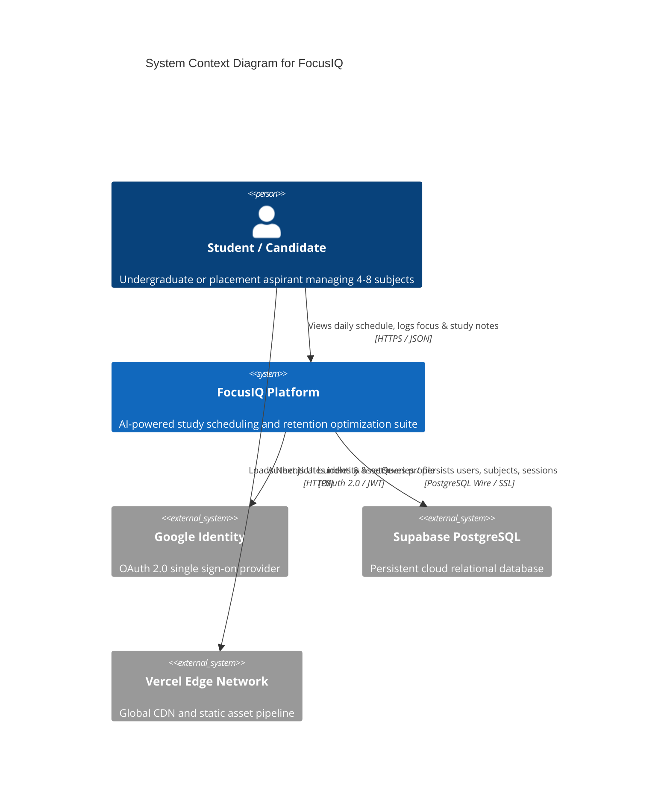
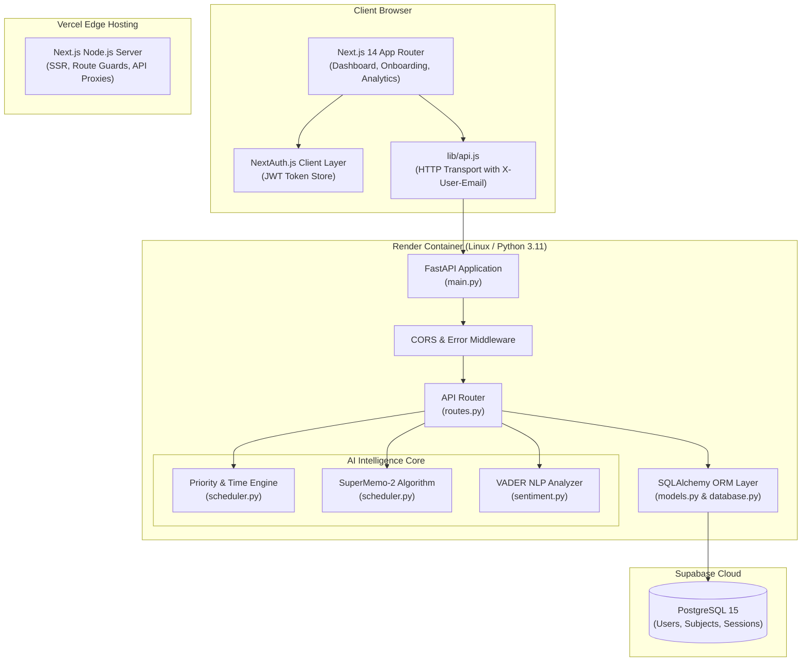
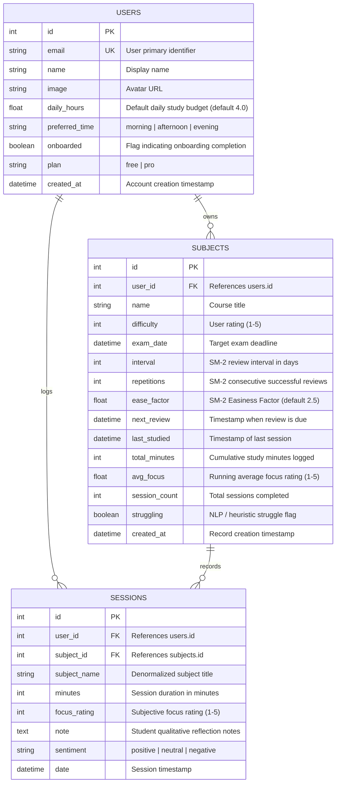

# 🏗️ FocusIQ — System Architecture & Technical Design

**Author:** Kartik Garg, AI Product Manager  
**System Version:** v2.0.0  
**Status:** Production Ready  

---

## 1. Architectural Overview & Design Philosophy

FocusIQ is built as a **decoupled, event-driven AI SaaS application**. The architecture strictly separates the **client presentation layer** from the **data science & cognitive scheduling microservice**. 

```
┌─────────────────────────────────┐           ┌──────────────────────────────────┐
│   Next.js 14 Frontend (Edge)   │           │   FastAPI Python Backend (Async) │
│  - React 18 App Router          │  HTTP /   │  - Pydantic Data Validation      │
│  - Tailwind Glassmorphism UI    │  REST     │  - SM-2 Spaced Repetition Engine │
│  - NextAuth JWT Session Layer   │ ────────> │  - VADER NLP Sentiment Pipeline  │
│  - Recharts Visualizations      │           │  - Multi-Factor Priority Engine  │
└─────────────────────────────────┘           └──────────────────────────────────┘
                                                               │
                                                               │ SQLAlchemy ORM
                                                               ▼
                                              ┌──────────────────────────────────┐
                                              │   Cloud Database (PostgreSQL)    │
                                              │  - Supabase Managed Database     │
                                              │  - Connection Pooling (Pre-ping) │
                                              │  - Full Relational Cascade Schema│
                                              └──────────────────────────────────┘
```

### Core Architectural Principles
1. **Separation of Concerns:** Frontend handles zero scheduling math or sentiment inference; it strictly functions as a reactive view-layer.
2. **AI Native Foundation:** Backend is natively authored in Python 3.11+, allowing direct integration with computational libraries (`vaderSentiment`, `math`, `scikit-learn` in Phase 2) without foreign function interfaces (FFI) or Node-to-Python subprocess overhead.
3. **Sub-800ms Latency SLA:** Core scheduling and session logging operations execute deterministically in memory via compiled Python routines, eliminating external LLM network latency.
4. **Resilient Persistence:** Dual-engine database adapter supports zero-config SQLite for local development and Supabase PostgreSQL with automated connection pooling for cloud deployments.

---

## 2. Visual System Topology


---

## 3. C4 System Context & Component Architecture

### 3.1. Level 1: System Context Diagram



### 3.2. Level 2: Container & Subsystem Breakdown



---

## 4. Subsystem Specifications

### 4.1. Frontend Architecture (`/frontend`)
The presentation layer is built with **Next.js 14.2** utilizing the App Router architecture:

* **Route Organization:**
  * `/`: High-converting marketing landing page featuring live value proposition, dynamic feature matrix, and pricing cards.
  * `/login`: Unified authentication interface supporting Google OAuth single sign-on and credentials fallback.
  * `/onboarding`: Dynamic form enabling students to set initial coursework (up to 8 subjects), exam target dates, subject difficulty sliders (1–5), and daily study capacity.
  * `/dashboard`: The central cockpit displaying productivity gauges, study streaks, active reminders, and prioritized interactive study cards.
  * `/analytics`: Interactive analytical suite powered by `recharts` (Bar charts for 7-day volume, line charts for focus quality heatmaps, and donut charts for topic splits).
* **State & Authentication Flow:**
  * Authentication state is handled via `NextAuth v4` using a stateless JWT strategy.
  * Client requests are orchestrated through a unified client wrapper (`/lib/api.js`). 
  * Every outgoing API call automatically injects the authenticated student's email into the custom header:
    ```http
    X-User-Email: student@example.com
    Content-Type: application/json
    ```
* **Design System & Styling:**
  * Implemented with **Tailwind CSS 3.4** adhering to a dark-mode glassmorphism aesthetic inspired by Linear and Stripe.
  * Core design tokens: Deep slate backgrounds (`#0B0F17`), subtle card backdrops (`rgba(255,255,255,0.03)`), glowing violet accents (`#8B5CF6`), and responsive typography using system fonts.

---

### 4.2. Backend Architecture (`/backend`)
The backend microservice is implemented with **FastAPI** running on top of **Uvicorn ASGI**:

* **Application Entry (`main.py`):**
  * Implements `lifespan` context manager handling automated database schema initialization (`init_db()`) and environment validation.
  * Configures strict CORS middleware permitting verified frontend origins (`FRONTEND_URL`, `http://localhost:3000`).
  * Features global HTTP exception middleware that traps unhandled exceptions, logs full stack traces, and returns safe, sanitized error payloads:
    ```json
    { "detail": "Internal server error. Please try again later." }
    ```
* **Dependency Injection Pipeline (`routes.py`):**
  * `get_db()`: Generator function yielding an isolated SQLAlchemy session per request and guaranteeing cleanup via `finally: db.close()`.
  * `require_user()`: Header-inspection dependency that resolves the `X-User-Email` header, queries the database, or automatically invokes `get_or_create_user()` to ensure zero-friction onboarding.
* **Auto-Seeding Engine:**
  * When a new student profile is detected, `/api/user/sync` silently seeds four standard foundational computer science subjects (Data Structures & Algorithms, DBMS, Operating Systems, Computer Networks).
  * This guarantees that first-time users land directly on a populated, actionable dashboard with an instant "Aha!" moment.

---

### 4.3. AI & Algorithmic Processing Engine

The intelligence subsystem consists of two specialized Python modules:

1. **`scheduler.py` (Deterministic Scheduling & Spaced Repetition):**
   * **Priority Scoring Algorithm:** Computes a composite urgency score out of 100 based on four weighted behavioral and academic vectors.
   * **Time Allocation Solver:** Distributes the user's available daily hours proportionally across subjects, enforcing a minimum of 20 minutes and a maximum of 90 minutes per block (rounded to 5-minute intervals).
   * **SuperMemo-2 (SM-2) Engine:** Adapts memory review intervals ($I$) and easiness factors ($EF$) based on student-reported focus scores.
   * **Proactive Nudge Generator:** Monitors neglect thresholds ($\ge 3$ days) and exam proximity ($\le 7$ days) to synthesize contextual warnings.

2. **`sentiment.py` (VADER NLP & Struggle Extraction):**
   * Employs the `vaderSentiment` lexicon to compute compound polarity scores on qualitative session notes.
   * Scans text against a curated lexicon of 20 struggle-indicators (`confused`, `stuck`, `lost`, `cant understand`, `overwhelmed`, `failed`).
   * When negative sentiment or struggle keywords are identified, the subject is tagged with `struggling = True`, triggering an immediate priority elevation in the scheduling pipeline.

---

## 5. Database Schema & Data Dictionary

FocusIQ utilizes a normalized relational schema managed via SQLAlchemy ORM.

### 5.1. Entity-Relationship Diagram (ERD)



### 5.2. Database Configuration & Connection Management

The database layer dynamically adapts based on environment:

```python
# database.py configuration
if DATABASE_URL.startswith("sqlite"):
    engine = create_engine(
        DATABASE_URL,
        connect_args={"check_same_thread": False},
    )
else:
    # PostgreSQL / Supabase connection pooling configuration
    if DATABASE_URL.startswith("postgres://"):
        DATABASE_URL = DATABASE_URL.replace("postgres://", "postgresql://", 1)

    engine = create_engine(
        DATABASE_URL,
        pool_pre_ping=True,       # Validates socket connection before query execution
        pool_recycle=300,         # Recycles idle connections every 5 minutes
        pool_size=5,              # Persistent connection pool size
        max_overflow=10,          # Temporary overflow limit for peak traffic
    )
```

---

## 6. Security & Infrastructure Topology

### 6.1. Security Architecture
* **Stateless Client Sessions:** JWT session tokens managed by NextAuth prevent server-side session fixation and scale horizontally across edge regions.
* **Header Authorization:** Endpoints validate the `X-User-Email` header against the caller's session context.
* **SQL Injection Immunity:** All database interactions utilize parameterized queries via SQLAlchemy ORM; raw string concatenation is prohibited.
* **CORS Sandboxing:** Strict origin validation restricts API access exclusively to the verified Vercel production domain and local development ports.

### 6.2. Deployment Infrastructure

| Component | Provider | Tier | Configuration |
|:---|:---|:---|:---|
| **Frontend** | Vercel Edge | Hobby / Pro | Node.js 18.x, Next.js 14 SSR & Edge CDN |
| **Backend API** | Render Cloud | Free / Starter | Python 3.11, Dockerized Uvicorn ASGI |
| **Database** | Supabase | Free / Pro | Managed PostgreSQL 15, SSL enforcement |

---

## 7. Scalability & Latency SLAs

* **Schedule Synthesis P95:** `< 40ms` (In-memory algorithmic computation over relational indexes).
* **Session Logging & NLP P95:** `< 120ms` (VADER sentiment evaluation + SM-2 persistence).
* **Cold-Start Resilience:** Database reconnect logic (`pool_pre_ping=True`) ensures seamless recovery after serverless spin-downs without connection drops.
