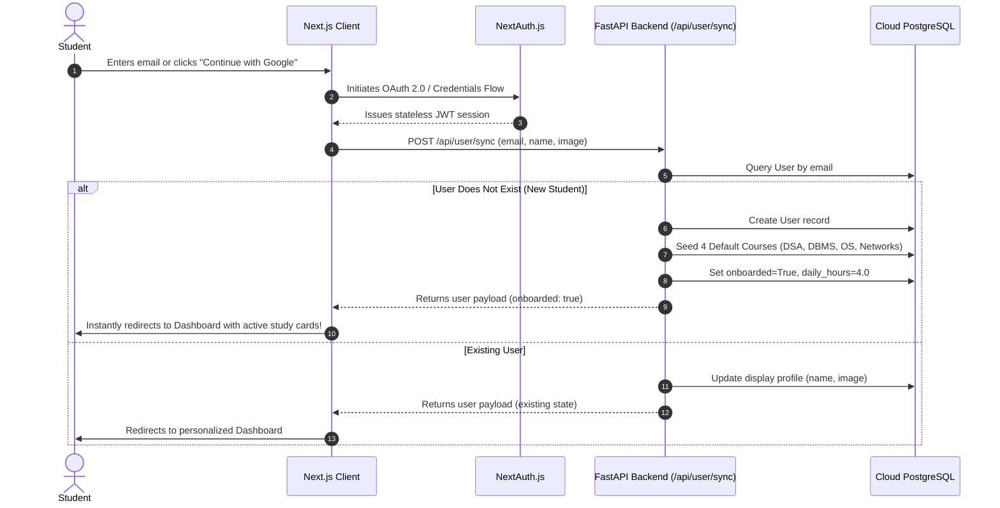
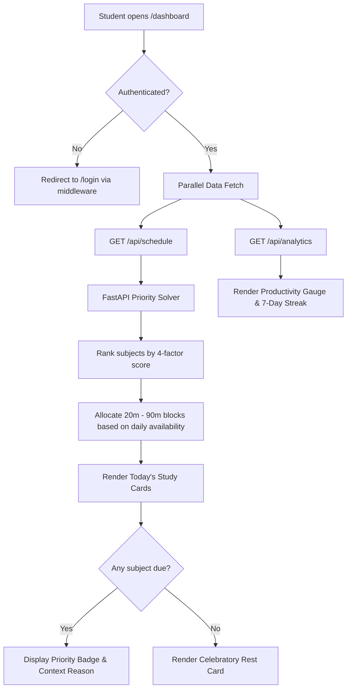
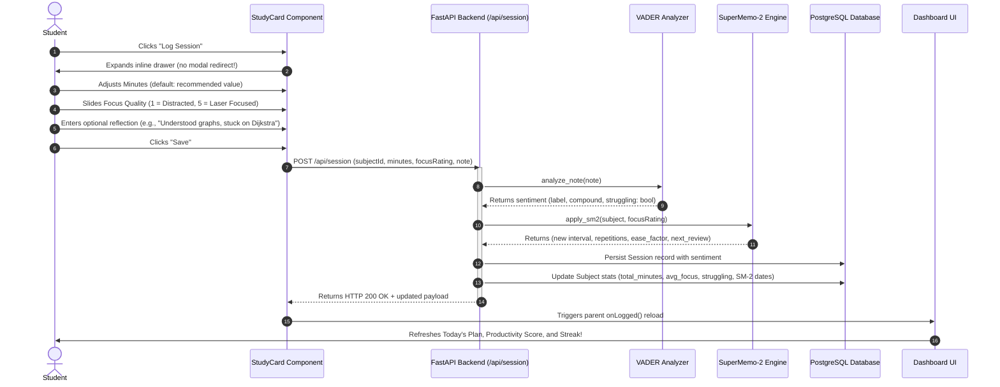
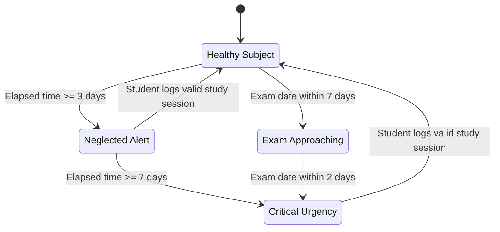

# 🗺️ FocusIQ — User Flow & Product Experience Blueprint

**Author:** Kartik Garg, AI Product Manager  
**Target Release:** v1.0 / v2.0  
**Status:** Approved  

---

## 1. Executive Summary & The Core Loop

Traditional study planners suffer from **high administrative friction and static obsolescence**: students spend 30–45 minutes manually organizing schedules that fall apart the moment a session is missed. 

FocusIQ replaces manual maintenance with a **self-optimizing behavioral feedback loop**:

```
                  ┌─────────────────────────────────────────┐
                  │          1. AI Daily Schedule           │
                  │   Ranks subjects & allocates minutes    │
                  └────────────────────┬────────────────────┘
                                       │
                                       ▼
                  ┌─────────────────────────────────────────┐
                  │          2. Study Execution             │
                  │     Student executes focused block      │
                  └────────────────────┬────────────────────┘
                                       │
                                       ▼
                  ┌─────────────────────────────────────────┐
                  │         3. 30-Second Quick Log          │
                  │   Logs duration, focus (1-5), and notes │
                  └────────────────────┬────────────────────┘
                                       │
                                       ▼
                  ┌─────────────────────────────────────────┐
                  │       4. AI Cognitive Processing        │
                  │   VADER NLP struggle mining + SM-2      │
                  └────────────────────┬────────────────────┘
                                       │
                                       ▼
                  ┌─────────────────────────────────────────┐
                  │       5. Adaptive Schedule Update       │
                  │ Re-calibrates intervals & updates alerts│
                  └────────────────────┴────────────────────┘
```

---

## 2. Visual User Journey & Lifecycle Diagram


---

## 3. End-to-End User Journeys & State Transitions

### 3.1. Phase 1: Frictionless Authentication & Auto-Seeded FTUX

The first 30 seconds of user interaction dictate long-term activation. To prevent **"Blank Canvas Paralysis"**, FocusIQ implements an automated onboarding intercept.



* **Outcome:** Time-to-Value (TTV) is reduced from 10 minutes to **under 25 seconds**. The student immediately experiences an intelligent, populated dashboard.
* **Customization:** Students desiring custom coursework can navigate to `/onboarding` anytime to adjust course titles, exam dates, difficulty levels (1–5), and daily study capacity.

---

### 3.2. Phase 2: Daily Schedule Consumption

Upon accessing `/dashboard`, the student receives an intelligent, ranked study agenda.



#### Study Card Elements:
* **Priority Header:** Color-coded status indicator:
  * 🔴 **High Priority (`score > 7`):** Urgent focus required.
  * 🟠 **Medium Priority (`score > 4`):** Maintenance review.
  * 🟢 **Low Priority (`score ≤ 4`):** Stable retention.
* **AI Reason Pill:** Natural-language justification generated by the rule engine (e.g., *"Not studied for 4 days"*, *"Exam in 3 days!"*, *"Low focus history"*).
* **Recommended Study Block:** Exact minutes allocated based on priority share (e.g., `60 Mins`).
* **Spaced Repetition Flag:** `🔄 Review Due` pill dynamically rendered when the SuperMemo-2 interval has matured.

---

### 3.3. Phase 3: The 30-Second Session Logging Loop

When a study session is finished, recording the outcome must be completely frictionless to avoid tracker abandonment.



---

### 3.4. Phase 4: Proactive Alerts & Neglect Interception

FocusIQ actively defends the student's curriculum from blindspots. Two automated triggers constantly evaluate subject health:



* **Neglected Warnings:**
  * **Medium Severity (`≥ 3 days`):** Amber notification: *"Database Management Systems not studied in 3 days"*.
  * **High Severity (`≥ 7 days`):** Crimson alert: *"Operating Systems not studied in 8 days!"*.
* **Exam Urgency Warnings:**
  * **Medium Severity (`≤ 7 days`):** Informational countdown.
  * **High Severity (`≤ 2 days`):** Priority boost to ensure last-mile revision.

---

### 3.5. Phase 5: Analytics & Habit Reinforcement

The `/analytics` page visualizes student behavioral data to reinforce study habits:

1. **7-Day Study Streak (Bar Chart):** Daily volume in minutes over the past week.
2. **Focus Heatmap / Trend (Line Chart):** Daily focus rating (0–5 scale) showing quality fluctuations.
3. **Time per Subject (Donut Chart):** Color-coded distribution showing time balance across courses.
4. **Productivity Score (Composite Metric):**
   $$\text{Score} = \min\left(100, \min\left(40, \frac{\text{Mins}_{7d}}{420} \times 40\right) + \left(\frac{\text{AvgFocus}_{7d}}{5} \times 40\right) + \left(\frac{\text{ActiveDays}_{7d}}{7} \times 20\right)\right)$$

---

## 4. User Personas & Journey Mapping

### Persona A: Arjun (The Placement Candidate)
* **Demographics:** 3rd Year CSE Undergraduate, preparing for campus placements.
* **Subjects:** 6 Courses (DSA, DBMS, OS, Networks, Aptitude, System Design).
* **Pain Point:** Spends 80% of his time coding DSA because it's comfortable, while completely neglecting Operating Systems and DBMS until 48 hours before an exam.
* **Journey with FocusIQ:**
  1. Signs in via Google; FocusIQ seeds his core courses.
  2. FocusIQ detects OS hasn't been studied in 5 days; automatically ranks OS at the top with a 60-minute allocation.
  3. Arjun logs a 45-minute session with note: *"Struggled with virtual memory page tables"*.
  4. VADER NLP flags `struggling = True`; FocusIQ keeps OS in his top rotation for tomorrow with a dedicated review block.
  5. Arjun passes his midterms with zero cramming stress.

### Persona B: Priya (The Upskilling Professional)
* **Demographics:** Working software developer preparing for cloud certifications.
* **Subjects:** 3 tracks (AWS Solutions Architect, Kubernetes, Golang).
* **Pain Point:** Studies inconsistently on weekends; forgets fundamental AWS architecture concepts due to lack of spaced review.
* **Journey with FocusIQ:**
  1. Configures 2 hours daily study capacity.
  2. Rates a Kubernetes session focus as 5/5; SM-2 expands the review interval to 6 days.
  3. Rates an IAM networking session focus as 2/5; SM-2 immediately resets interval to 1 day.
  4. FocusIQ surfaces the IAM networking card the very next morning, securing retention before the memory decays.

---

## 5. Edge Cases & UX Safeguards

| Scenario | System Reaction | User Experience |
|:---|:---|:---|
| **Zero Scheduled Subjects** | Backend returns `schedule: []` | Dashboard displays a celebratory state card: *"🎉 You have no subjects scheduled for today. Take a break!"* |
| **New User First Login** | `/api/user/sync` triggers auto-seeding | User bypasses blank state and instantly views a functional 4-subject dashboard |
| **Past Exam Date** | `days_until()` returns $\le 0$ | Exam urgency clamps to maximum score ($10.0$); alerts switch to overdue status |
| **Network Disconnection** | HTTP fetch fails in `StudyCard.js` | User receives an explicit alert: *"Failed to log session. Please try again."*; draft input remains cached in form |
| **Unauthenticated Route Access** | Next.js `middleware.js` intercepts route | Instant server-side redirect to `/login` with preserved `callbackUrl` |
