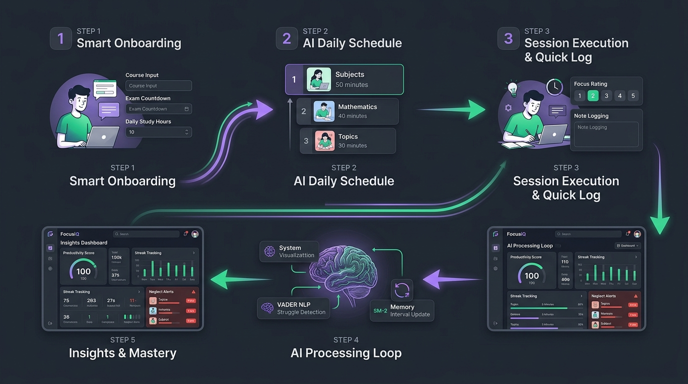

# 📚 FocusIQ Documentation Hub

Welcome to the comprehensive documentation repository for **FocusIQ** — the AI-powered study optimizer designed by **Kartik Garg** (AI Product Manager). 

FocusIQ eliminates the daily cognitive paralysis students face (*"What should I study today?"*) by dynamically generating prioritized, adaptive study schedules grounded in **SuperMemo-2 (SM-2) Spaced Repetition** and **VADER Natural Language Processing (NLP)**.

---

## 🧭 Documentation Map

| Document | Purpose | Target Audience |
|:---|:---|:---|
| **[01. System Architecture](./01_SYSTEM_ARCHITECTURE.md)** | Technical design, decoupled stack topology, C4 model, database schema, security & data flow | Software Engineers, Architects, Technical PMs |
| **[02. User Flow & Experience](./02_USER_FLOW_AND_JOURNEYS.md)** | End-to-end user journeys, sequence diagrams, FTUX auto-seeding, 30-second logging loop | Product Designers, UI/UX Engineers, PMs |
| **[03. AI & Algorithmic Engine](./03_AI_AND_ALGORITHMIC_ENGINE.md)** | Mathematical formulations, SM-2 algorithm, 4-factor priority score, VADER NLP sentiment engine | Data Scientists, ML Engineers, AI PMs |
| **[04. Product Requirements Document (PRD)](./04_PRODUCT_REQUIREMENTS_DOCUMENT.md)** | Problem framing, 5 Whys, user personas, JTBD, feature specs (P0-P2), 8 KPIs, v1-v2 roadmap | Product Managers, Founders, Stakeholders |
| **[05. API Specification](./05_API_SPECIFICATION.md)** | REST API reference, request/response schemas, auth headers, database dictionary | Frontend/Backend Developers, Integrators |
| **[06. PM Strategic Decision Journal](./06_PM_DECISION_JOURNAL.md)** | Product crossroads, trade-off evaluations, strategic rationale for technical & product choices | Hiring Managers, Product Leaders, Interviewers |
| **[07. Deployment & DevOps Guide](./07_DEPLOYMENT_AND_DEVOPS_GUIDE.md)** | Production deployment on Vercel, Render & Supabase, local setup, troubleshooting runbook | DevOps, SREs, Full-Stack Engineers |
| **[AI PM Reference Dossier (PDF)](./FocusIQ_AI_Product_Manager_Reference.pdf)** | Original product case study, 5 Whys, interview preparation frameworks, resume bullets | Recruiters, Interviewers, PM Mentors |

---

## 🏛️ High-Level System Snapshot

FocusIQ is engineered with a **modern, decoupled architecture** that separates high-frequency presentation from data science and cognitive intelligence computation:

### Core Technology Stack
- **Frontend**: Next.js 14 (App Router), React 18, Tailwind CSS, Recharts, NextAuth.js v4
- **Backend API**: Python 3.11+, FastAPI (Async REST), SQLAlchemy ORM, Pydantic, Uvicorn
- **AI & NLP Layer**: Pure Python SuperMemo-2 (SM-2) implementation, VADER Sentiment Intensity Analyzer (`vaderSentiment`)
- **Persistence**: Supabase PostgreSQL (Production connection pooler) / SQLite (Zero-config local development)
- **Cloud Infrastructure**: Vercel (Frontend Edge Hosting) + Render (FastAPI Cloud Container)

---

## 🔄 Core Product Feedback Loop

Unlike static calendars or note-taking apps that decay over time, FocusIQ operates on an **adaptive, closed behavioral feedback loop**:

1. **Smart Onboarding & Auto-Seeding**: Students connect via Google/Email; new accounts are auto-seeded with standard coursework to deliver immediate Time-to-Value (TTV < 30s).
2. **AI Daily Scheduling**: A 4-factor scoring algorithm calculates optimal daily study blocks based on exam proximity, neglect penalty, difficulty, and focus history.
3. **1-Tap Session Logging**: Students log sessions with time spent, 1–5 focus rating, and qualitative reflection notes in under 30 seconds.
4. **Behavioral AI Processing**: VADER NLP analyzes notes for struggle sentiment while SM-2 recalibrates memory retention intervals.
5. **Continuous Adaptation**: Neglected subjects trigger proactive alerts, and dashboard analytics visually reinforce study consistency.

---

## 📊 Live Links & Repositories

- **Production Application**: [https://focus-iq-two.vercel.app](https://focus-iq-two.vercel.app)
- **Interactive API Documentation**: [https://focusiq-api.onrender.com/docs](https://focusiq-api.onrender.com/docs)
- **Source Code Repository**: [https://github.com/kg3478/FocusIQ](https://github.com/kg3478/FocusIQ)
- **Author & AI Product Manager**: **Kartik Garg** ([LinkedIn](https://www.linkedin.com/in/kartik-garg-a94760191) · [GitHub](https://github.com/kg3478))
